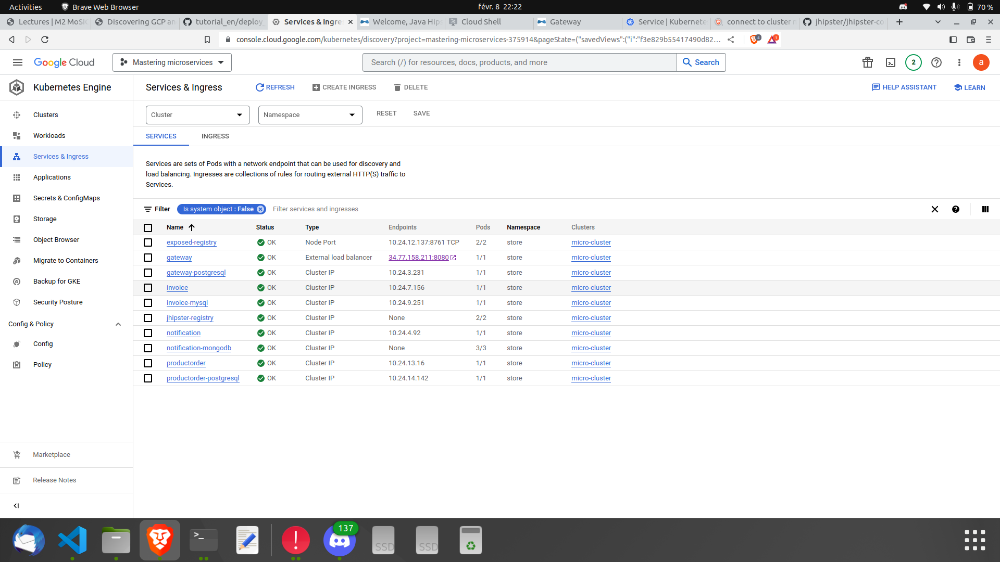

# Introduction

Microservices have become increasingly popular in recent years as a way
to build scalable and resilient applications. They allow for development
teams to work on independent components, which can be deployed, updated,
and managed separately. This approach results in a more flexible and
efficient system, compared to monolithic architecture.

When deploying microservices, it is important to choose the right
platform to support their needs. There are several cloud-based platforms
available, such as Amazon Web Services (AWS), Google Cloud Platform
(GCP), and Heroku. In this report, we will focus on deploying a JHipster
microservice cluster to the Kubernetes engine in GCP.

# JHipster and Microservices

JHipster is a popular open-source platform for generating, developing,
and deploying modern web applications and microservices. It provides a
pre-configured set of technologies, including Angular or React for the
front-end, Spring Boot for the back-end, and either MySQL or MongoDB for
the database.

In this project, we will deploy a JHipster microservice cluster, which
consists of multiple independent microservices that communicate with
each other to provide a complete application. Each microservice will be
deployed as a separate container in a Kubernetes cluster, allowing for
easy scaling and management.

# Generation of the microservices architecture

The generation of each microservice with Jhipster went mostly without
issues since they were launched independently using **docker-compose**
and **gradlew**, and all services (Invoice, Notification, ProductOrder)
were detected by the jhipster-registry service successfully. That's for
the part without entities, as for the refactoring of the application
schema we chose the following patterns to define the **sku, upc,
imageCdnUrl, thumbnailCdnUrl** of the ProductOrder entity:

``` {#lst:jdl-code caption="JHipster Domain Language code" label="lst:jdl-code" breaklines="true"}
sku String required pattern(/^[a-zA-Z0-9-]{1,50}$/)
upc String required pattern(/^[0-9]{12}$/)
...
/** For the content delivery network */
imageCdnUrl String pattern(/^https?:\/\/(?:[a-zA-Z0-9.-]*\.)?(?:cdn|cdn\.(?:[a-zA-Z]{2,}))\.(?:com|net|org)\/.*\.(?:jpg|jpeg|png|gif|bmp|tiff)$/)
...
/** For the content delivery network */
thumbnailCdnUrl String pattern(/^https?:\/\/.*\/thumb\/.*\.(?:jpg|jpeg|png|gif|bmp|tiff)$/)
```

# Microservices with Docker-compose

However for the docker-compose part where everything is bundled in a
single group of containers the **notification** microservice fails to
stay up because of an initialization issue with the MongoDB cluster mode
since by default neither the replica sets or the config servers are
initialized. So we had to manually execute and evaluate some
initialization commands inside the containers and re-launch the
notification container. The details for the initialization process are
available on this Jhipster link :
<https://www.jhipster.tech/docker-compose/#mongodb-cluster-mode>

One issue we could not solve in this part is monitoring. The services
for Prometheus and Grafana are properly up, but they cannot communicate
with the gateway server throwing the error **connection refused**.
Moreover, unlike the part where every service is launched separately in
the docker-compose bundle there are no default dashboards for the
grafana service to use.

# Microservices deployed on GCP

Deployment on the Google cloud platform requires a good **Kubernetes**
cluster so that each machine has enough resources to sustain its pods
and deployed microservice/s. We chose the following configuration :

  | **Name of the cluster**        | micro-cluster             |
  | :----------------------------- | ------------------------- |
  | **Auto-scalable cluster**      | YES                       |
  | **Number of nodes**            | 5                         |
  | **Prometheus feature enabled** | YES                       |
  | **Machine type**               | Standard (2 cpu, 8GB RAM) |

Any other configurations were left on default. When the cluster is
ready, all that is left to do is to push the images of the microservices
onto the container registry and launch them as services on the cluster
using the provided Jhipster shell program **./kubectl-apply.sh -f** (-f
is the default option for the command as it requires an argument to
execute).

<figure id="fig 1">

<figcaption>Deployment of microservices on GCP</figcaption>
</figure>

<figure id="fig 2">

<figcaption>From the GCP shell</figcaption>
</figure>

<figure id="fig 3">

<figcaption>Horizontal autoscaling for Invoice microservice</figcaption>
</figure>

<figure id="fig 4">

<figcaption>GCP dashboard</figcaption>
</figure>

The result looks like figure [1] and [2]. We also enabled horizontal pod autoscaling for a
service (Invoice) as illustrated in figure [3]. The GCP dashboard
while the services are deployed looked like figure [4].

# Load Injection with Gatling

Instead of the offered version for Gatling (2.3.1) we used the latest
version (3.9.0) because of a few reasons :

-   An issue with **gatling.sh** which did not execute properly and
    throws errors

-   The UI interface for **recorder.sh** offers the option of specifying
    the output type (java 8, java 11, scala, etc \...)

-   The default outputs of version 2.3.1 is in scala and it produces
    some errors in the compilation phase

The result of the load injection with Gatling looks as shown in figure
[5]. The report is
available as well as the simulation used in the Github repository (in
the folder gatling-charts-highcharts-bundle-3.9.0-bundle). We didn't
notice any significant changes on the GCP dashboard after the Gatling
simulation and we suspect that the simulation being light it didn't
affect the cluster as much.

<figure id="fig 5">

<figcaption>Running a Gatling recorder simulation on the
gateway</figcaption>
</figure>
